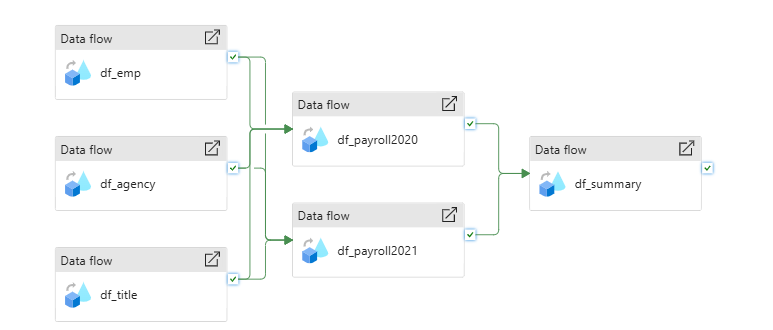
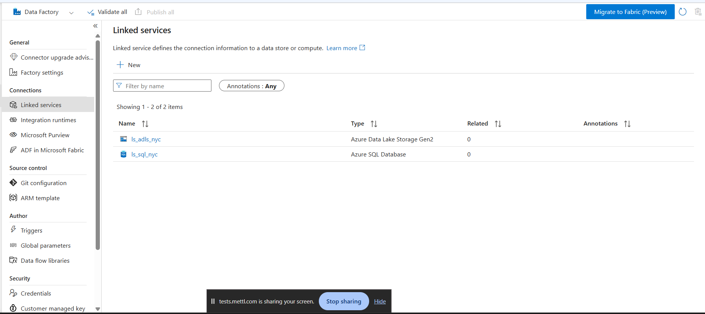
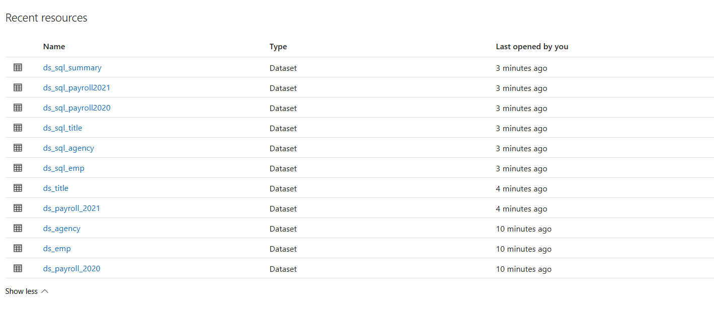
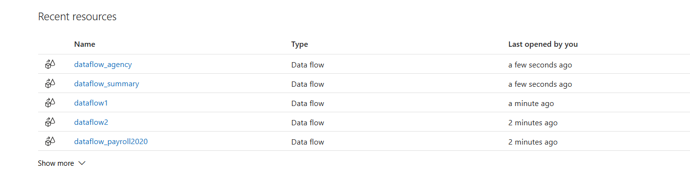
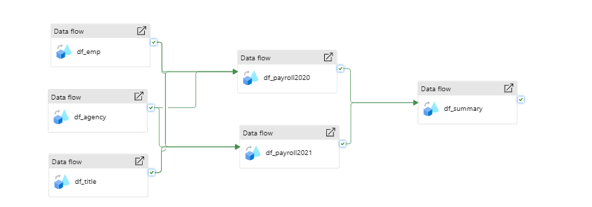
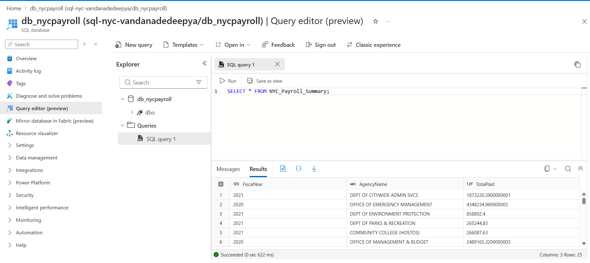
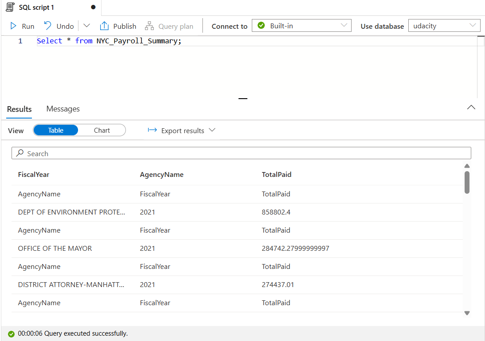
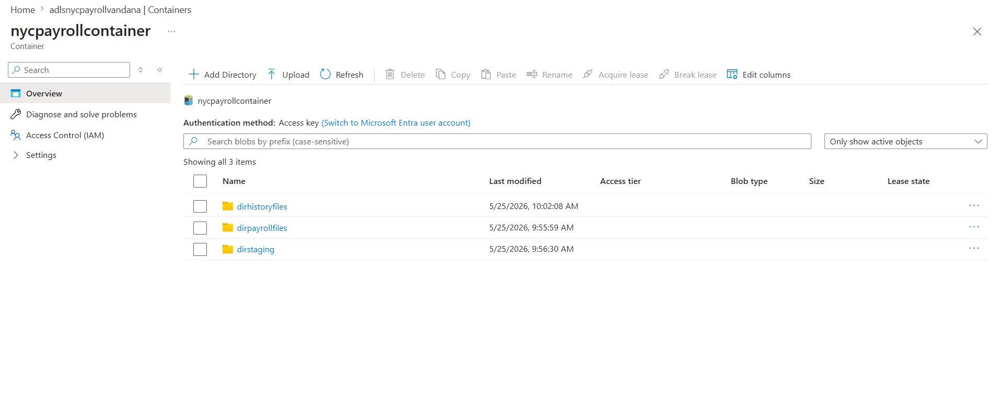
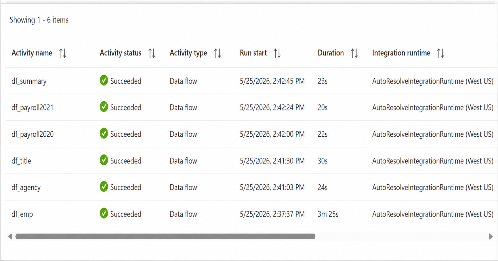

# 🚀 NYC Payroll Data Engineering Project

## 📌 Overview

This project demonstrates the design and implementation of an end-to-end data engineering pipeline using Azure services. The pipeline processes NYC payroll datasets, transforms the data, and loads it into a structured format for analysis.

---

## 🧱 Architecture

The pipeline is built using Azure Data Factory, Data Lake Storage, and Synapse Analytics.



---

## ⚙️ Technologies Used

* Azure Data Factory (ADF)
* Azure Data Lake Storage Gen2 (ADLS)
* Azure Synapse Analytics
* SQL

---

## 🔗 Linked Services

Connections were established to integrate storage and database services.



---

## 📂 Datasets

Multiple datasets were created to handle input and output data sources.



---

## 🔄 Dataflows

Dataflows were used to transform and process the datasets.



---

## 🔧 Data Transformation Example

Example transformation logic applied within dataflows.



---

## 📊 SQL Output

Processed data was loaded into SQL and validated using queries.



---

## 📈 Synapse Output

Data successfully queried and visualized in Synapse Analytics.



---

## 🗄️ Data Lake Storage

Raw and staged data stored in Azure Data Lake.



---

## ✅ Pipeline Execution

Successful execution of pipeline activities in ADF Monitor.



---

## 🧠 Key Learnings

* Built end-to-end ETL pipeline using Azure services
* Implemented data transformations using Dataflows
* Integrated ADLS with SQL and Synapse
* Debugged real-world data pipeline errors

---

## 📁 Repository Structure

```text
README.md
screenshots/
code/
```

---

## 📌 Conclusion

This project showcases the practical implementation of a scalable cloud-based data engineering pipeline using Azure ecosystem tools.
